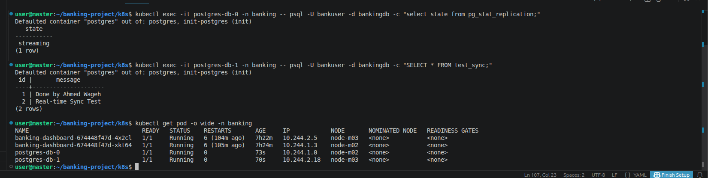
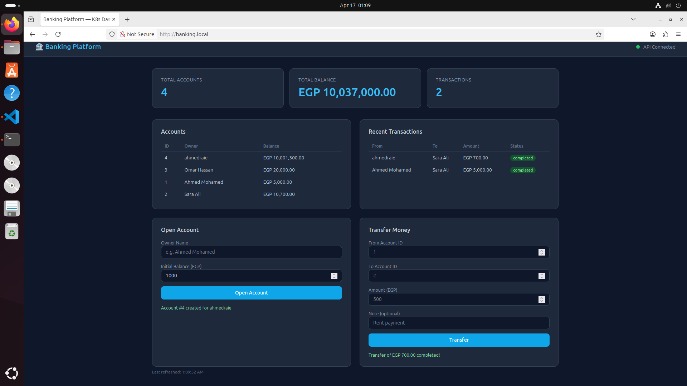

🚀 Cloud-Native Banking Platform (Kubernetes)

A Cloud-Native Banking Platform deployed on a 3-node Kubernetes cluster using Docker, Node.js, NGINX, and PostgreSQL.

This project demonstrates real-world DevOps and Kubernetes practices including container orchestration, scaling, networking, high availability, and debugging distributed systems.

🏗️ Architecture

User requests are routed through a Kubernetes Ingress Controller, which directs traffic to the frontend dashboard or backend API depending on the requested path.

User
  │
  ▼
Ingress Controller
  │
  ├── / → Dashboard (NGINX)
  │
  └── /api → Backend API (Node.js)
                    │
                    ▼
              PostgreSQL Cluster
         (2 Nodes - Synchronous Replication)
🗄️ High Availability Database Design

The PostgreSQL database is deployed as a StatefulSet with two replicas running on two different Kubernetes worker nodes.

To ensure high availability and data consistency:

Each database pod runs on a separate node using Pod Anti-Affinity rules.
This prevents both database instances from being scheduled on the same node.
The two database pods maintain synchronous replication, ensuring that data written to the primary node is replicated to the secondary node in real time.

Database layout:

Worker Node 1
└── postgres-db-0 (Primary)

Worker Node 2
└── postgres-db-1 (Replica)
##############################
###################
############
Replication: Synchronous

##############
####################
##############################
This architecture provides:

High Availability
Data Consistency
Fault Tolerance
⚙️ Auto Scaling

The platform implements both Horizontal Pod Autoscaler (HPA) and Vertical Pod Autoscaler (VPA).

Horizontal Pod Autoscaler (HPA)

Automatically increases or decreases the number of pods based on CPU usage.

Example scaling:

Low Traffic  → 2 Pods
High Traffic → 6 Pods
Vertical Pod Autoscaler (VPA)

Automatically adjusts container CPU and memory requests based on real usage patterns.

Benefits:

Prevents resource over-provisioning
Improves cluster efficiency
Optimizes application performance
☸️ Kubernetes Concepts Used
Deployments
StatefulSets
Services (ClusterIP)
Ingress Controller
ConfigMaps
RBAC
Network Policies
Pod Anti-Affinity
Horizontal Pod Autoscaler (HPA)
Vertical Pod Autoscaler (VPA)
Multi-node Scheduling

📁 Project Structure
banking-platform-k8s/
│
├── app/
│   ├── api/
│   │   ├── Dockerfile
│   │   └── app.js
│   │
│   └── dashboard/
│       ├── Dockerfile
│       ├── nginx.conf
│       └── html/
│
├── k8s/
│   ├── 00-namespace.yaml
│   ├── 01-configmap.yaml
│   ├── 03-postgres-db.yaml
│   ├── 04-api-deploy.yaml
│   ├── 05-dashboard-deploy.yaml
│   ├── 06-hpa.yaml
│   ├── 07-ingress.yaml
│   ├── 08-vpa.yaml
│   ├── 09-rbac.yaml
│   └── 10-networkpolicy.yaml
│
├── images/
│   └── dashboard.png
│
└── README.md
🚀 How to Run

Start a 3-node Minikube cluster

minikube start --nodes 3 -p node

Enable ingress controller

minikube addons enable ingress

Build application images

docker build -t banking-api:v1 app/api
docker build -t banking-dashboard:v1 app/dashboard

Load images into Minikube

minikube image load banking-api:v1
minikube image load banking-dashboard:v1

Deploy Kubernetes resources

kubectl apply -f k8s/
🌐 Access the Application

Get Minikube IP

minikube ip

Add to your hosts file

<INGRESS_IP> banking.local

#######################3

Open in browser

http://banking.local

API health check

http://banking.local/api/health
📸 Dashboard Preview

⚠️ Challenges Solved

During this project several real Kubernetes challenges were solved:

Multi-node pod scheduling
PostgreSQL replication setup
Ingress routing and path rewriting
Kubernetes service communication
Cluster debugging
👨‍💻 Author

Ahmed Rabie Wageh

DevOps & Cloud Enginee